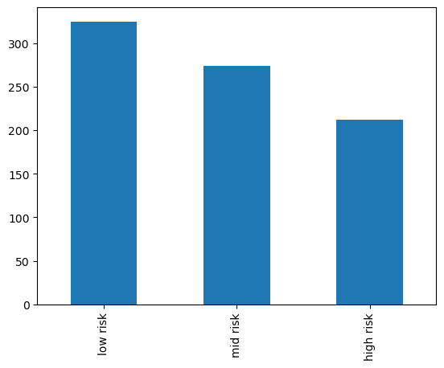
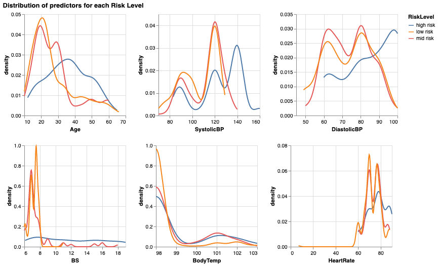
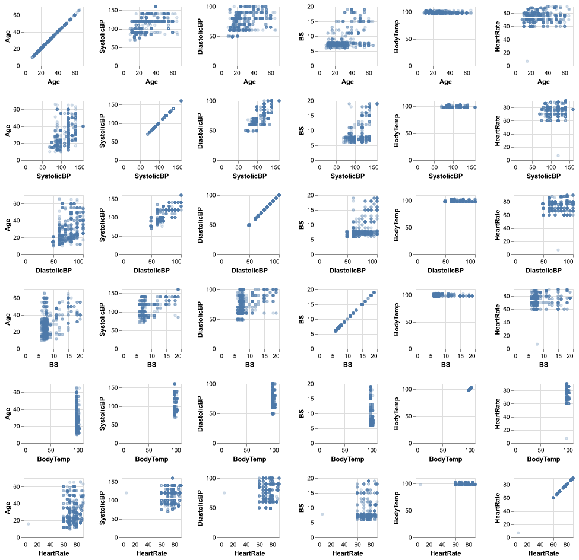

```{r setup, include=FALSE}
knitr::opts_chunk$set(echo = FALSE)
library(knitr)
library(tidyverse)
library(kableExtra)
```

## Authors

- Lennon Au-Yeung
- Chenyang Wang
- Shirley Zhang

(Team 14) 

# Summary

This data analysis project was created in fulfillment of the team project requirements for DSCI 522 (Data Science Workflows), a course in the Master of Data Science program at the University of British Columbia.

# Introduction

Maternal mortality is a large risk in lower and lower middle-income countries, with about 810 women dying from preventable pregnancy-related causes each day (WHO, 2019). Often, there is a lack of information about the woman's health during pregnancy, making it difficult to monitor their status and determine whether they may be at risk of complications (Ahmed and Kashem, 2020). A potential solution to this issue is through using the 'Internet of Things (IoT)', or physical sensors which can monitor and report different health metrics of a patient to their health care provider. Medical professionals can then analyze this information to determine whether a patient may be at risk. 

For this project, we aim to answer the question: 

> **"Can we use data analysis methods to predict the risk level of a patient during pregnancy (low, mid, or high) given a number of metrics describing their health profile?"** 

This is an important question to explore given that human resources are low in lower income countries, and non-human dependent classification methods can help provide this information to more individuals. Furthermore, classifying a patient's risk level through data-driven methods may be advantageous over traditional methods which may involve levels of subjectivity. 

IoT sensors can collect a diverse range of health metrics, however not all of them may be useful in predicting whether a patient is at risk of adverse health outcomes. Thus, we also hope to use data analysis methods to infer (sub-question) whether some metrics may be more important in determining maternal health risk levels than others. 

# Methods 

## Data 

Data used in this study was collected between 2018 and 2020, through six hospitals and maternity clinics in rural areas of Bangladesh (Ahmed and Kashem, 2020). Patients wore sensing devices which collected health data such as temperature and heart rate. The risk factor of each patient was determined through following a guideline based on previous research and consultation with medical professionals. 

The full data set was sourced from the UCI Machine Learning Repository (Dua and Graff 2017), and can be found [here](https://archive.ics.uci.edu/ml/datasets/Maternal+Health+Risk+Data+Set). A .csv format of the data can be directly downloaded using [this link](https://archive.ics.uci.edu/ml/machine-learning-databases/00639/Maternal%20Health%20Risk%20Data%20Set.csv). The data can be attributed to Marzia Ahmed (Daffodil International University, Dhaka, Bangladesh) and Mohammod Kashem (Dhaka University of Science and Technology, Gazipur, Bangladesh) (Ahmed and Kashem, 2020).  

The data set contains six features describing a patient's health profile, including `age`, `SystolicBP` (systolic blood pressure in mmHG), `DiastolicBP` (diastolic blood pressure in mmHG), `BS` (blood glucose levels in mmol/L), `BodyTemp` (body temperature in Fahrenheit), and `HeartRate` (heart rate in beats per minute). There are 1014 instances in total, with each row corresponding to one patient. Finally, the data contains the attribute `RiskLevel`, corresponding to a medical expert's determination of whether the patient is at low, mid, or high risk (Ahmed et al., 2020). 

## Planned Analysis

## Exploratory Data Analysis 
- The figure 1 shows the distribtion across target classes, as we can see from the bar chart below, there is not a  drastic class imbalanace in the training data, however, we will still explore whether a balanced class weight will improve our model performance.

```{r fig.align="center", fig.cap="Figure 1. Counts of observation for each class in train data set"}

```


- The figure 2 is the density distribution across all features, which could provideus with insights on whether the distribution of some features are different for different target classes. 

```{r fig.align="center", fig.cap="Figure 2. Distribution of training set predictors for high risk, mid risk and low risk"}

```
- The figure 3 shows the features SystolicBP and DiastolicBP have high correlation compared to other pairs of predictors, followed by the correlation between the two blood pressure levels and age. For other pairs of predictors, there are no significant correlations found.

```{r fig.align="center", fig.cap="Figure 3. Pairwise relationship between predictors"}

```

## Model Building


- We have tried the following models: 1. Dummy Classifier; 2. Decision Tree; 3. Support Vector Machines (SVMs); 4. Logistic Regression; 5. K-Nearest Neighbors (KNN).

For all above models, we used the default parameters and did not include hyperparameter optimization at this stage. Table 1 is the models comparison, and it shows the training scores and mean cross validation scores of the models we tried. Based on the results, we choose Decision Tree model because it has the highest mean cross validation score.

```{r load data}
model_comparison <- read.csv("../src/maternal_risk_model_figures/model_comparison_table.csv", row.names=1, heade=TRUE)
kable(model_comparison, caption = "Table 1. Models comparison")
```

- hyperpamater optimization
use random search, try different max depth 1 and 50, best is 29, include plot_3 hyperpar_plot,

- score at the test data, the score is 0.823

- confusion matrix, incluse table_2(test_data_confusion_matrix),

## Planned Analysis

# Results

# Assumptions and Limitations

# Future Directions


# References