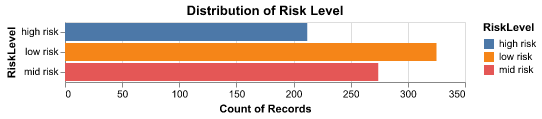
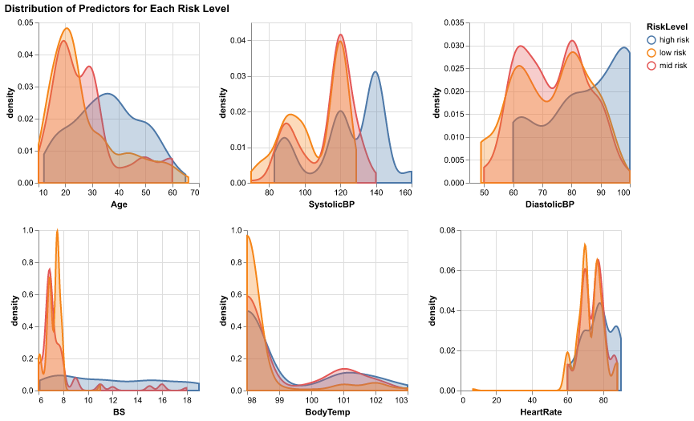
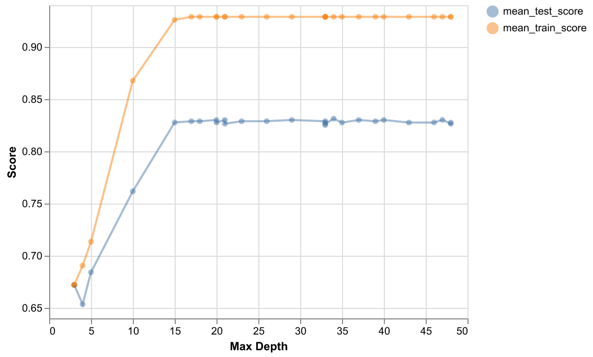

Maternal Health Risk Predictor
================

-   <a href="#authors" id="toc-authors">Authors</a>
-   <a href="#summary" id="toc-summary">Summary</a>
-   <a href="#introduction" id="toc-introduction">Introduction</a>
-   <a href="#methods" id="toc-methods">Methods</a>
    -   <a href="#data" id="toc-data">Data</a>
    -   <a href="#planned-analysis" id="toc-planned-analysis">Planned
        Analysis</a>
    -   <a href="#exploratory-data-analysis"
        id="toc-exploratory-data-analysis">Exploratory Data Analysis</a>
-   <a href="#results" id="toc-results">Results</a>
    -   <a href="#model-building" id="toc-model-building">Model Building</a>
-   <a href="#assumptions-and-limitations"
    id="toc-assumptions-and-limitations">Assumptions and Limitations</a>
-   <a href="#future-directions" id="toc-future-directions">Future
    Directions</a>
-   <a href="#references" id="toc-references">References</a>

## Authors

-   Lennon Au-Yeung
-   Chenyang Wang
-   Shirley Zhang

(Team 14)

# Summary

This data analysis project was created in fulfillment of the team
project requirements for DSCI 522 (Data Science Workflows), a course in
the Master of Data Science program at the University of British
Columbia.

# Introduction

Maternal mortality is a large risk in lower and lower middle-income
countries, with about 810 women dying from preventable pregnancy-related
causes each day (WHO, 2019). Often, there is a lack of information about
the woman’s health during pregnancy, making it difficult to monitor
their status and determine whether they may be at risk of complications
(Ahmed and Kashem, 2020). A potential solution to this issue is through
using the ‘Internet of Things (IoT)’, or physical sensors which can
monitor and report different health metrics of a patient to their health
care provider. Medical professionals can then analyze this information
to determine whether a patient may be at risk.

For this project, we aim to answer the question:

> **“Can we use data analysis methods to predict the risk level of a
> patient during pregnancy (low, mid, or high) given a number of metrics
> describing their health profile?”**

This is an important question to explore given that human resources are
low in lower income countries, and non-human dependent classification
methods can help provide this information to more individuals.
Furthermore, classifying a patient’s risk level through data-driven
methods may be advantageous over traditional methods which may involve
levels of subjectivity.

IoT sensors can collect a diverse range of health metrics, however not
all of them may be useful in predicting whether a patient is at risk of
adverse health outcomes. Thus, we also hope to use data analysis methods
to infer (sub-question) whether some metrics may be more important in
determining maternal health risk levels than others.

# Methods

## Data

Data used in this study was collected between 2018 and 2020, through six
hospitals and maternity clinics in rural areas of Bangladesh (Ahmed and
Kashem, 2020). Patients wore sensing devices which collected health data
such as temperature and heart rate. The risk factor of each patient was
determined through following a guideline based on previous research and
consultation with medical professionals.

The full data set was sourced from the UCI Machine Learning Repository
(Dua and Graff 2017), and can be found
[here](https://archive.ics.uci.edu/ml/datasets/Maternal+Health+Risk+Data+Set).
A .csv format of the data can be directly downloaded using [this
link](https://archive.ics.uci.edu/ml/machine-learning-databases/00639/Maternal%20Health%20Risk%20Data%20Set.csv).
The data can be attributed to Marzia Ahmed (Daffodil International
University, Dhaka, Bangladesh) and Mohammod Kashem (Dhaka University of
Science and Technology, Gazipur, Bangladesh) (Ahmed and Kashem, 2020).

The data set contains six features describing a patient’s health
profile, including `age`, `SystolicBP` (systolic blood pressure in
mmHG), `DiastolicBP` (diastolic blood pressure in mmHG), `BS` (blood
glucose levels in mmol/L), `BodyTemp` (body temperature in Fahrenheit),
and `HeartRate` (heart rate in beats per minute). There are 1014
instances in total, with each row corresponding to one patient. Finally,
the data contains the attribute `RiskLevel`, corresponding to a medical
expert’s determination of whether the patient is at low, mid, or high
risk (Ahmed et al., 2020).

## Planned Analysis

## Exploratory Data Analysis

-   The figure 1 shows the distribtion across target classes, as we can
    see from the bar chart below, there is not a drastic class
    imbalanace in the training data, however, we will still explore
    whether a balanced class weight will improve our model performance.

-   The figure 2 is the density distribution across all features, which
    could provide us with insights on whether the distribution of some
    features are different for different target classes.

-   The figure 3 shows the features SystolicBP and DiastolicBP have high
    correlation compared to other pairs of predictors, followed by the
    correlation between the two blood pressure levels and age. For other
    pairs of predictors, there are no significant correlations found.

# Results

## Model Building

-   We have tried the following models: 1. Dummy Classifier; 2. Decision
    Tree; 3. Support Vector Machines (SVMs); 4. Logistic Regression; 5.
    K-Nearest Neighbors (KNN).

For all above models, we used the default parameters and did not include
hyperparameter optimization at this stage. Table 1 is the models
comparison, and it shows the training scores and mean cross validation
scores of the models we tried. Based on the results, we choose Decision
Tree model because it has the highest mean cross validation score.

<table class="table" style="width: auto !important; margin-left: auto; margin-right: auto;">
<caption>
Table 1. Models comparison
</caption>
<thead>
<tr>
<th style="text-align:left;">
</th>
<th style="text-align:right;">
Dummy
</th>
<th style="text-align:right;">
Decision.Tree
</th>
<th style="text-align:right;">
SVM
</th>
<th style="text-align:right;">
Logistic.Regression
</th>
<th style="text-align:right;">
K.Nearest.Neighbors
</th>
</tr>
</thead>
<tbody>
<tr>
<td style="text-align:left;">
Training Score
</td>
<td style="text-align:right;">
0.401
</td>
<td style="text-align:right;">
0.928
</td>
<td style="text-align:right;">
0.714
</td>
<td style="text-align:right;">
0.607
</td>
<td style="text-align:right;">
0.797
</td>
</tr>
<tr>
<td style="text-align:left;">
Mean Cross Validation Score
</td>
<td style="text-align:right;">
0.401
</td>
<td style="text-align:right;">
0.808
</td>
<td style="text-align:right;">
0.695
</td>
<td style="text-align:right;">
0.610
</td>
<td style="text-align:right;">
0.668
</td>
</tr>
</tbody>
</table>

-   Hyperparameter optimization: For the decision tree model, we use
    random search method to try different max depth from 1 to 50. From
    the figure 3, we can see the best depth is 29, and the mean test
    score is 0.823 which is not bad.

-   Table 3 is the confusion matrix which shows the prediction rate is
    consistently across all risk levels.

<table class="table" style="width: auto !important; margin-left: auto; margin-right: auto;">
<caption>
Table 2. Confusion Matrix
</caption>
<thead>
<tr>
<th style="text-align:left;">
</th>
<th style="text-align:right;">
High.Risk
</th>
<th style="text-align:right;">
Low.Risk
</th>
<th style="text-align:right;">
Mid.Risk
</th>
</tr>
</thead>
<tbody>
<tr>
<td style="text-align:left;">
High Risk
</td>
<td style="text-align:right;">
53
</td>
<td style="text-align:right;">
1
</td>
<td style="text-align:right;">
6
</td>
</tr>
<tr>
<td style="text-align:left;">
Low Risk
</td>
<td style="text-align:right;">
1
</td>
<td style="text-align:right;">
68
</td>
<td style="text-align:right;">
12
</td>
</tr>
<tr>
<td style="text-align:left;">
Mid Risk
</td>
<td style="text-align:right;">
4
</td>
<td style="text-align:right;">
10
</td>
<td style="text-align:right;">
48
</td>
</tr>
</tbody>
</table>

# Assumptions and Limitations

# Future Directions

As mentioned in the introduction, we are trying to determine whether the
patient is at risk, while identifying patients with a high risk level
should be our priority. In the future, we could combine low and mid risk
level into singular class so that we would have a binary classifier such
that we can then explore different classification metrics such as recall
instead of using accuracy as our only scoring metrics to evaluate our
model. Recall would be an ideal scoring metric in this case as we are
trying to minimize the number of false negatives such that high risk
patients are not being misclassified by the model.

# References
